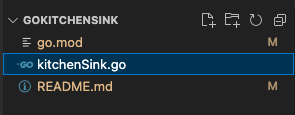
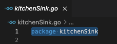

# Kitchen Sink Go Package

## What is this
This is a repo to learn how to use go packages. Called kitchen sink because it'll contain any and all functions.

## Why use a separate repo?
Go packages only work with a root level repo. It cannot be a nested repo.

## How to publish
```bash
# Push latest code change
git push

# List current tags
git tag

# Create a new release tag
# Tags are correct as long as they are unique,
# but for go package use semver
git tag v0.0.7

# Push tag
git push --tag
```

## Hard lessons
1. In order for package to be publishable,
- `module` in go.mod **must** be the code repo url. In this case, `github.com/danielkwok21/Kitchen-Sink`  


- entrypoint file must be called the same as package nam in entry point file. In this case `kitchenSink.go`  




## Common errors
1. During client installation, received error `module declares its path as x but required y`

    Make sure 1. in [Hard lessons](./README.md#hard-lessons) is correct